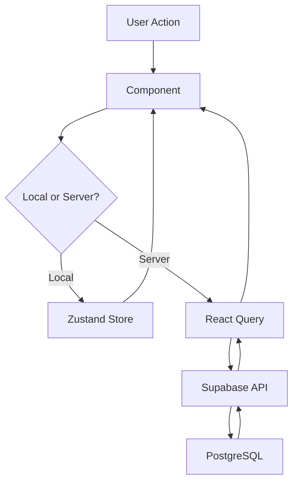

# 🏗️ Arquitetura do Adega Anita Mobile

## Stack Tecnológica

### Core
- **React Native** via Expo Managed Workflow
- **TypeScript** (Strict Mode, NO `any` types)
- **Expo Router** (File-based routing em `src/app/`)

### Styling
- **NativeWind v4** (TailwindCSS para mobile)
- **Skia** (@shopify/react-native-skia) para glassmorphism e efeitos
- **NO StyleSheet.create** (exceto valores dinâmicos)

### Estado
- **Zustand** - Client state (UI, preferências)
- **React Query** - Server state (Supabase data)
- **AsyncStorage** - Persistência local

### Animações
- **Reanimated v3** - Interações complexas (`withSpring`)
- **Moti** - Mount/unmount simples

---

## 📁 Estrutura de Pastas

```
src/
├── app/                      # Routes (Expo Router)
│   ├── _layout.tsx          # Root layout
│   ├── index.tsx            # Home
│   └── (tabs)/              # Tab navigator group
├── components/
│   ├── ui/                  # Componentes atômicos reutilizáveis
│   └── layout/              # Layouts e navegação
├── features/                # Lógica de negócio por domínio
│   ├── inventory/
│   ├── sales/
│   └── delivery/
├── core/
│   ├── providers/           # Context providers
│   ├── stores/              # Zustand stores
│   └── api/                 # Supabase client
└── lib/
    └── utils.ts             # Utilitários gerais
```

---

## 🎨 Padrões de Design

### 1. Componentes UI (`src/components/ui/`)
- **Atômicos** e **reutilizáveis**
- **Props tipadas** com interfaces
- **Dumb components** (sem lógica de negócio)
- Exemplo: `<Button />`, `<Card />`, `<Input />`

### 2. Features (`src/features/`)
- **Smart components** com lógica
- Organizado por domínio de negócio
- Cada feature tem sua pasta com:
  - `components/` - Componentes específicos
  - `hooks/` - Custom hooks
  - `types.ts` - TypeScript types
  - `store.ts` - Zustand store (se necessário)

### 3. Rotas (`src/app/`)
- File-based routing
- Grupos com `(tabs)`, `(stack)`, etc.
- `_layout.tsx` para layouts aninhados

---

## 🚫 Anti-Patterns (O que NÃO fazer)

### ❌ NUNCA faça isso:
1. **Usar `any` em TypeScript** → Use tipos explícitos ou `unknown`
2. **StyleSheet.create para estilos estáticos** → Use NativeWind classes
3. **Lógica de negócio em componentes UI** → Mova para `features/`
4. **Cores hardcoded** → Use tokens do `tailwind.config.js`
5. **Fetch direto** → Use React Query hooks
6. **State global desnecessário** → Prefira prop drilling para estados locais

### ✅ Sempre faça isso:
1. **Haptics em botões** → `Haptics.selectionAsync()`
2. **Safe Areas** → Wrap com `SafeAreaView`
3. **Glassmorphism** → Use `bg-glass-surface border-glass-stroke`
4. **Imports absolutos** → `@/components/...` ao invés de `../../`
5. **Error Boundaries** → Wrap rotas críticas

---

## 🔄 Fluxo de Dados



---

## 📝 Convenções de Código

### Naming
- **Componentes**: PascalCase (`ProductCard.tsx`)
- **Hooks**: camelCase com `use` prefix (`useProducts.ts`)
- **Stores**: camelCase com `Store` suffix (`inventoryStore.ts`)
- **Types**: PascalCase (`Product`, `SaleItem`)

### Exports
- **Named exports** para componentes
- **Default export** apenas em rotas (`app/`)

### Comentários
- Apenas para lógica complexa ou não-óbvia
- Use JSDoc para funções públicas

---

## 🔐 Segurança

- **NUNCA** hardcode API keys → Use `expo-constants`
- **Row Level Security (RLS)** ativado no Supabase
- **Validação** no frontend E backend
- **AsyncStorage** apenas para dados não-sensíveis

---

## 📊 Performance

- **Lazy load** de rotas pesadas
- **Memoize** componentes caros com `React.memo`
- **useCallback/useMemo** para evitar re-renders
- **React Query cache** para dados do servidor

---

> **Referência Rápida**: Se vai criar um arquivo, pergunte-se:
> - Onde ele deveria viver nessa estrutura?
> - Ele segue os padrões do Kyrie Stack?
> - Ele usa os tokens do design system?
