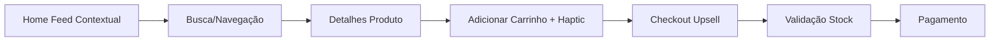
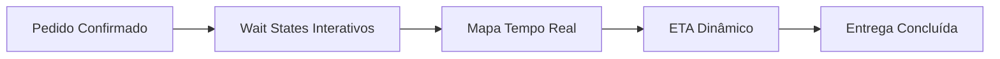
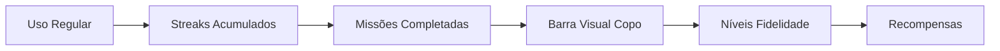

# 👥 User Stories - Adega Anita Mobile

> **Fonte:** Extraído do PRD 3.0 (Deep Research Edition)  
> **Foco:** App de Delivery para Cliente Final com Design Espacial "Apple-like"

## Personas

### Cliente Final
- Compra vinhos via app de delivery
- Valora experiência premium e UX excepcional
- Sensível a gamificação e recompensas
- Busca conveniência e descoberta contextual

---

## 🎯 Épicos

### Epic 1: Descoberta Contextual
Feed dinâmico que muda conforme horário e localização, com prova social.

### Epic 2: Catálogo de Produtos
Listagem e detalhamento de produtos com experiência visual premium.

### Epic 3: Carrinho & Checkout
Gestão de carrinho com upsell inteligente e validação de stock em tempo real.

### Epic 4: Logística & Rastreamento
Acompanhamento de entrega em tempo real com ETA dinâmico e wait states interativos.

### Epic 5: Gamificação & Fidelidade
Sistema de streaks, missões e níveis para maximizar retenção.

---

## 📖 User Stories

### Epic 1: Descoberta Contextual

#### US-001: Feed Dinâmico por Horário
**Como** cliente  
**Quero** ver produtos relevantes ao horário do dia  
**Para** encontrar o que preciso mais rapidamente

**Fonte PRD:** Seção 4.1

**Critérios de Aceitação:**
- [ ] Sexta 18h: Destaque "Esquenta" e "Destilados"
- [ ] Domingo 11h: Destaque "Vinhos para Almoço" e "Espumantes"
- [ ] Layout do feed muda dinamicamente

---

#### US-002: Prova Social em Produtos
**Como** cliente  
**Quero** ver avaliações sociais nos produtos  
**Para** tomar decisões mais informadas

**Fonte PRD:** Seção 4.1

**Critérios de Aceitação:**
- [ ] Tag "Elogiado pela embalagem"
- [ ] Tag "Mais vendido no seu bairro" (query geoespacial)
- [ ] Exibição visual nas cards

---

#### US-003: Busca Elástica com Facetas
**Como** cliente  
**Quero** buscar por características específicas  
**Para** encontrar exatamente o que preciso

**Fonte PRD:** Seção 3.1

**Critérios de Aceitação:**
- [ ] Busca: "Vinho tinto seco < 50 reais"
- [ ] Full Text Search (Postgres `websearch_to_tsquery`)
- [ ] Filtragem por tipo, preço, características

---

### Epic 2: Catálogo de Produtos

#### US-004: Visualizar Lista de Produtos
**Como** cliente  
**Quero** ver todos os produtos disponíveis  
**Para** navegar pelo catálogo

**Fonte PRD:** Roadmap Fase 2

**Critérios de Aceitação:**
- [ ] Listagem com imagens (Supabase Storage)
- [ ] Exibição de preço, nome, categoria
- [ ] Cards com `<SkiaGlassCard />` (glassmorphism)

---

#### US-005: Ver Detalhes do Produto
**Como** cliente  
**Quero** ver informações completas de um produto  
**Para** decidir se vou comprar

**Fonte PRD:** Seção 5.1

**Critérios de Aceitação:**
- [ ] Foto expande com Shared Element Transition
- [ ] Descrição completa do produto
- [ ] Informações técnicas
- [ ] Botão "Adicionar ao Carrinho"

---

### Epic 3: Carrinho & Checkout

#### US-006: Adicionar Produto ao Carrinho
**Como** cliente  
**Quero** adicionar produtos ao carrinho  
**Para** comprar múltiplos itens

**Fonte PRD:** Roadmap Fase 3

**Critérios de Aceitação:**
- [ ] Botão com haptic feedback ("Light Impact")
- [ ] Estado gerenciado por Zustand
- [ ] Atualização visual imediata

---

#### US-007: Upsell Inteligente
**Como** cliente  
**Quero** ser sugerido produtos que me dêem frete grátis  
**Para** aproveitar melhor o pedido

**Fonte PRD:** Seção 4.4

**Critérios de Aceitação:**
- [ ] Calcular diferença para frete grátis
- [ ] Sugerir produtos (snacks/águas) que preencham lacuna
- [ ] Lógica client-side

---

#### US-008: Validação de Stock Pré-Pagamento
**Como** cliente  
**Quero** ter certeza que o produto está disponível  
**Para** não ter pedidos cancelados

**Fonte PRD:** Seção 4.4  
**Termo PRD:** "Handshake Virtual"

**Critérios de Aceitação:**
- [ ] Validação milissegundos antes do pagamento
- [ ] Bloqueio: criar pedido com status `pending`
- [ ] Feedback se stock indisponível

---

### Epic 4: Logística & Rastreamento

#### US-009: Ver ETA Dinâmico
**Como** cliente  
**Quero** saber quando meu pedido chegará  
**Para** me planejar

**Fonte PRD:** Seção 4.2

**Critérios de Aceitação:**
- [ ] Cálculo: carga da cozinha + deslocamento
- [ ] Atualização em tempo real
- [ ] Exibição visual clara

---

#### US-010: Rastrear Entregador em Tempo Real
**Como** cliente  
**Quero** ver a localização do entregador  
**Para** acompanhar minha entrega

**Fonte PRD:** Seção 4.2

**Critérios de Aceitação:**
- [ ] Mapa com rota (Mapbox/Google Maps)
- [ ] Subscription Supabase (geolocalização entregador)
- [ ] Marcador atualizado constantemente

---

#### US-011: Wait States Interativos
**Como** cliente  
**Quero** ter algo para fazer enquanto espero  
**Para** reduzir percepção de tempo

**Fonte PRD:** Seção 4.2

**Critérios de Aceitação:**
- [ ] Tela de rastreamento não-passiva
- [ ] Animações Rive interativas
- [ ] Gamificação durante espera

---

### Epic 5: Gamificação & Fidelidade

#### US-012: Streaks de Pedidos
**Como** cliente  
**Quero** ganhar benefícios por pedir regularmente  
**Para** ser recompensado pela fidelidade

**Fonte PRD:** Seção 4.3

**Critérios de Aceitação:**
- [ ] Sistema de streaks (ofensivas)
- [ ] Tracking de semanas consecutivas
- [ ] Recompensa: "Frete grátis vitalício" (3 semanas)
- [ ] Estado salvo em `app_profiles`

---

#### US-013: Barra de Progresso Visual
**Como** cliente  
**Quero** ver visualmente meu progresso no programa de fidelidade  
**Para** me motivar a continuar comprando

**Fonte PRD:** Seção 4.3

**Critérios de Aceitação:**
- [ ] **NÃO** usar texto ("Faltam 2 pedidos")
- [ ] Usar gráfico Skia: copo enchendo de vinho
- [ ] Animação fluida (Reanimated Springs)
- [ ] Níveis de fidelidade marcados

---

#### US-014: Missões de Fidelidade
**Como** cliente  
**Quero** completar missões para ganhar recompensas  
**Para** ter objetivos no app

**Fonte PRD:** Seção 3.2 (Schema `loyalty_missions`)

**Critérios de Aceitação:**
- [ ] Tipos: `streak`, `frequency`, `value`
- [ ] Configuração de recompensas (JSONB)
- [ ] Tracking de progresso
- [ ] Notificações de missões completadas

---

## 🔄 Fluxos Principais

### Fluxo 1: Descoberta → Compra

### Fluxo 2: Rastreamento

### Fluxo 3: Gamificação

---

## 📋 Backlog Priorizado

### Roadmap PRD Fase 1 (Dias 1-2)
1. Setup Stack (Expo + NativeWind v4)
2. `<SkiaGlassCard />` e `<NoiseBackground />`
3. Tema e Tipografia

### Roadmap PRD Fase 2 (Dias 3-4)
4. US-004: Visualizar Lista de Produtos
5. US-005: Ver Detalhes do Produto
6. US-003: Busca Elástica

### Roadmap PRD Fase 3 (Dias 5-7)
7. US-006: Adicionar ao Carrinho
8. US-007: Upsell Inteligente
9. US-008: Validação de Stock
10. US-012: Streaks de Pedidos
11. US-013: Barra de Progresso Visual
12. US-014: Missões de Fidelidade

### Roadmap PRD Fase 4 (Dia 8+)
13. US-009: ETA Dinâmico
14. US-010: Rastreamento Tempo Real
15. US-011: Wait States Interativos
16. US-001: Feed Dinâmico
17. US-002: Prova Social

---

## 📊 Schema Supabase (do PRD 3.2)

### `app_profiles`
- Gamificação e nível de fidelidade

### `delivery_orders`
- `address_snapshot` (JSONB)
- `delivery_proof` (Text)

### `loyalty_missions`
- `mission_type` (streak, frequency, value)
- `reward_config` (JSONB)

---

## 📝 Notas de Produto

- **Foco 100% Cliente Final** (não há gerente/vendedor neste PRD)
- **Design Espacial Obrigatório** (Skia, Glassmorphism, Springs)
- **Performance: 60fps** (testes em dispositivos reais)
- **Haptics em tudo** (Light Impact para sucesso, Notification Error para erros)
